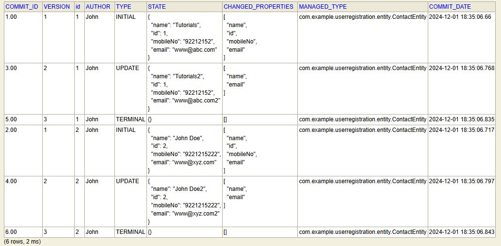
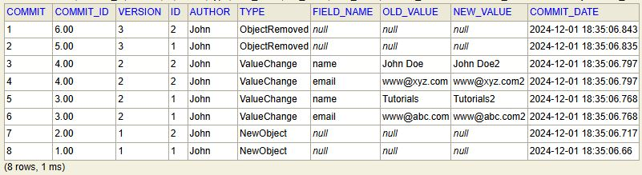
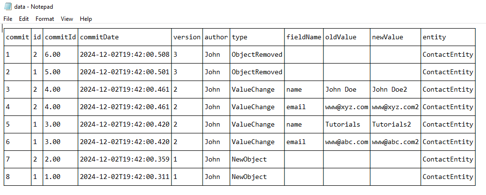

# Data auditing 

## This is a tutorial for auditing using [Javers](https://javers.org/documentation/jql-examples/)

## There is booking entity that contains contact entity. Add either one first, then edit or delete using Swagger

## Swagger url
    http://localhost:8080/swagger-ui/index.html

## Download swagger specifications
    http://localhost:8080/v3/api-docs.yaml

## Access table via Access h2 console

    http://localhost:8080/h2-console  
    JDBC URL: jdbc:h2:mem:audittable  
    SELECT * FROM JV_SNAPSHOT  

## There will be preloaded data

    add 2 new records
    edit both records
    delete both records

### For direct DB audit data

    SELECT commit_id,  version, g.local_id as "id",  author, type, state, changed_properties, managed_type, commit_date FROM jv_snapshot INNER JOIN jv_commit ON commit_pk = commit_fk INNER JOIN jv_global_id g ON g.global_id_pk = global_id_fk LEFT OUTER JOIN jv_global_id o ON o.global_id_pk = g.owner_id_fk WHERE 1 = 1 ORDER BY g.local_id

## Added table for custom audit mapping
Run the endpoint first and it will save for you your custom audit mapping.

    SELECT commit, commit_id, version, id, author, type, field_name, old_value, new_value, commit_date FROM AUDIT_MAPPED order by commit_date desc

## How to clean up snapshots and commits after a period of time in Javers?

Clean up can be done in the following order:

    DELETE FROM jv_commit_property;
    DELETE FROM jv_snapshot;
    DELETE FROM jv_commit;
    DELETE FROM jv_global_id WHERE owner_id_fk IS NOT NULL;
    DELETE FROM jv_global_id;
    Note : You can put the filter clause as per your need which is not considered in the above DB Script.

## Image samples

Default mapping

Custom mapping

Custom mapping to text file

